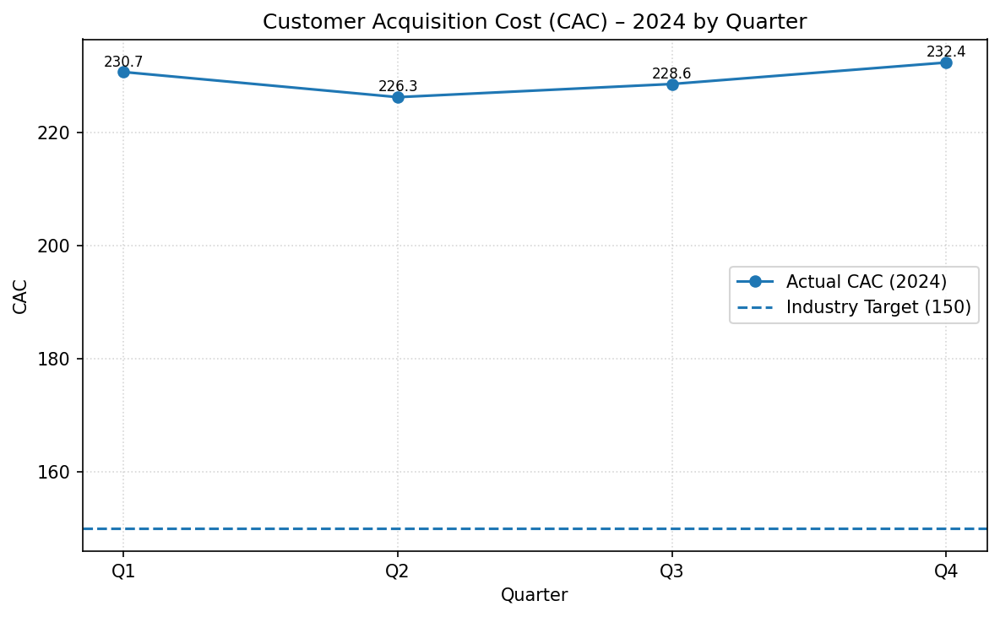

# 2024 Customer Acquisition Cost (CAC) Analysis  
**Repository:** financial-cac-analysis  
**Branch (for PR):** cac-analysis-2024  
**Email:** 24f2000871@ds.study.iitm.ac.in  

This project provides a detailed analysis of the 2024 Customer Acquisition Cost (CAC) performance for a financial services company.  
The primary goal is to understand why CAC remains significantly above the industry benchmark and to identify actionable recommendations to **optimize digital marketing channels** and reduce CAC toward the target of 150.

---

## 📊 Dataset

**Customer Acquisition Cost (CAC) – 2024 Quarterly Data**  
| Quarter | CAC     |
|--------|---------|
| Q1     | 230.71  |
| Q2     | 226.26  |
| Q3     | 228.59  |
| Q4     | 232.39  |

- **2024 Average CAC:** **229.49** (required exact value)  
- **Industry Target CAC:** 150  

---

## 🧮 Key Metrics

- **Absolute variance vs target:**  
  229.49 − 150 = **79.49**

- **Percentage above target:**  
  (79.49 / 150) × 100 ≈ **52.99% (~53%)**

- CAC remains consistently elevated across all quarters.

---

## 📈 Visualization: CAC Trend vs Industry Benchmark

Below is the plot comparing quarterly CAC against the benchmark target:



To reproduce the chart, run the analysis script found in:

cac_analysis.py

yaml
Copy code

This script computes metrics, prints insights, and generates `cac_trend.png`.

---

## 🔍 Insights & Data Story

### 1. CAC Consistently Exceeds Industry Target  
Every quarter in 2024 shows CAC values above 226, well above the industry benchmark of 150.  
The **average CAC (229.49)** is **~53% higher** than what is considered efficient.

### 2. No Sustained Improvement Over the Year  
- Q2 shows a slight improvement from Q1  
- Q3 increases again  
- Q4 rises to the highest point (232.39)  

This indicates that recent acquisition campaigns may be losing efficiency or cost pressure is rising.

### 3. Rising Marketing Costs Impact Profitability  
Higher CAC directly reduces customer acquisition profit margins.  
If CAC stays high while customer lifetime value (LTV) remains constant, long-term profitability will erode.

---

## 🧠 Business Implications

1. **Lower marketing ROI**  
   Increasing CAC without proportional LTV growth weakens the acquisition funnel economics.

2. **Poor channel efficiency**  
   Some marketing channels may be delivering diminishing returns as spend scales.

3. **Budget allocation challenges**  
   Funds directed toward inefficient channels reduce resources available for retention or product innovation.

---

## ✅ Recommendations to Reach CAC Target of 150

The core strategic solution is to **optimize digital marketing channels**.  
Below are specific actions supported by industry best practices:

### **1. Channel Reallocation Based on ROI**
- Identify high-CAC channels (e.g., paid social, paid search)
- Shift budget toward channels with strong conversion efficiency (e.g., SEO, email, affiliates)
- Enforce CAC thresholds as “cut points” for spend

### **2. Improve Targeting & Audience Segmentation**
- Deploy high-intent lookalike audiences  
- Reduce spend on low-conversion or low-value segments  
- Continuous testing of bidding strategies

### **3. Optimize Ad Creatives & Landing Pages**
- A/B test creatives, formats, CTAs  
- Improve landing page speed and clarity  
- Minimize form friction to elevate conversion rate

### **4. Strengthen Funnel Analytics & Attribution**
- Use multi-touch attribution to correctly value channels  
- Identify drop-off points and fix funnel inefficiencies  
- Track CAC at campaign, ad-set, and keyword levels

### **5. Quarterly CAC Targets**
Set progressive CAC targets:  
`210 → 190 → 170 → 150`  
Monitor variance and adjust channel mix every quarter.

---

## 🧪 Reproducibility & LLM Assistance

- Analysis implemented in **Python** (`cac_analysis.py`)
- Plot generated using **matplotlib**
- Code and narrative were developed with assistance from an LLM (e.g., Jules / ChatGPT Codex), as required
- To reproduce:

```bash
pip install pandas matplotlib
python cac_analysis.py
This will output metrics and regenerate cac_trend.png.
